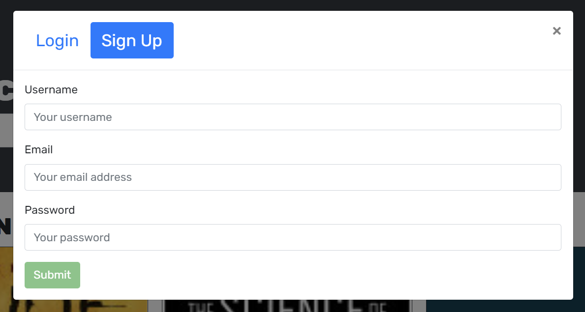
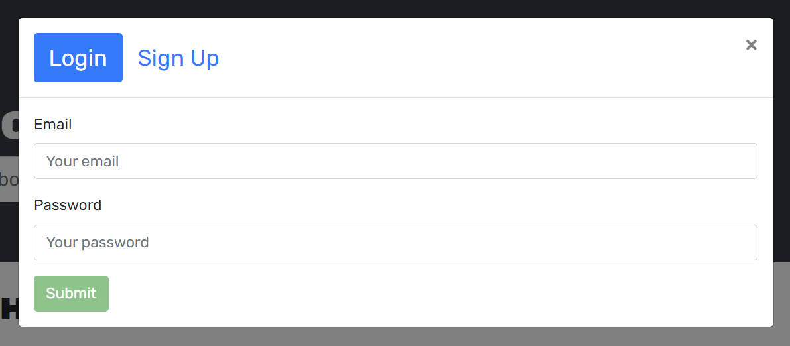
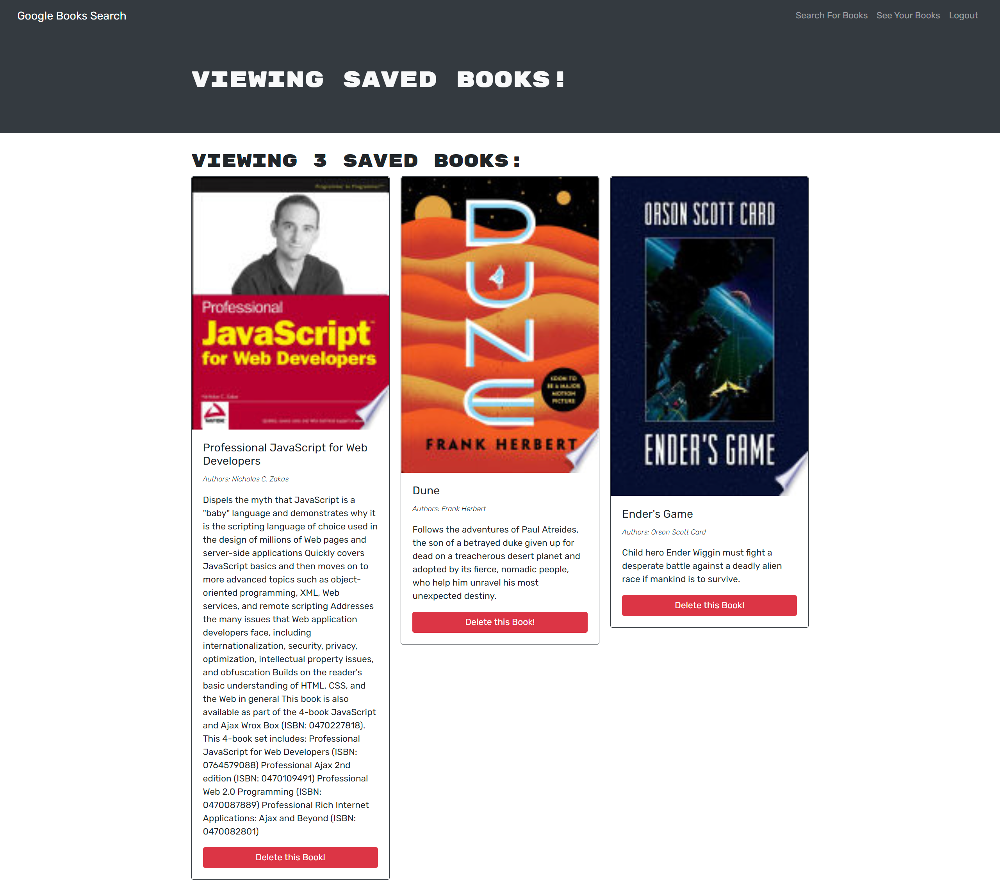

# Reading List Search Engine - GraphQL, Apollo Server, React, Node, Express, MongoDB

A Fullstack MERN search engine that can be used to find potential books to read. Users can create an account, search for books and save them to a personal list for future reference.

[A live demo can be found here.](https://whispering-waters-56314.herokuapp.com/)

This project uses the following technologies/libraries.

-   [GraphQL](https://graphql.org/) as an API querying language
-   [Apollo-Server-Express](https://www.npmjs.com/package/apollo-server-express) to Run a spec-compliant GraphQL Server with Express
-   [@apollo/client](https://www.npmjs.com/package/@apollo/client) to Work with GraphQL on the React App
-   [Google Books API](https://developers.google.com/books) to Query a Large Database of Books
-   [Bcrypt Package](https://www.npmjs.com/package/bcrypt) for Password Hashing and Management
-   [React](https://reactjs.org/) as a Fast and Powerful Frontend
-   [React-Router-Dom](https://www.npmjs.com/package/react-router-dom) for URL routing, URL parameters, Browser History Stack Usage, and Linking without Calling the Server
-   [Bootstrap 4](https://getbootstrap.com/docs/4.0/getting-started/introduction/) as a CSS Framework
-   [Node.js](https://nodejs.org/en/) and [Express.js](https://expressjs.com/) as the Server for API and HTTP Requests and Serving the React Build Directory Frontend
-   [MongoDB](https://www.mongodb.com/) as a NoSQL Database
-   [Mongoose](https://mongoosejs.com/) for [Object Relational Mapping](https://en.wikipedia.org/wiki/Object%E2%80%93relational_mapping), Database Interaction, [Routing](https://expressjs.com/en/guide/routing.html) and Collection Generation and Seeding
-   [Nodemon](https://nodemon.io/) for More Pleasant Node.js Development

## Installation

The client and server are two discrete applications. After cloning the repo, simply run `npm install` to get the packages for both the client and server. Then run `npm run dev` to run both the Node sever using Nodemon and the React Client using it's built in dev server. You need to install Concurrently for this command to work. It can be installed with `npm install -g concurrently`. The `npm run start` command is used when deploying the applications to a server.

The application will be available by default at `http://localhost:3000/` and API will be at `http://localhost:3001/graphql` if you are using a local development environment. It's assumed you already have MongoDB running on your development computer.

## GraphQL API

Followed are example queries and mutations that can be run directly against the server.

Get User:

```
query {
  user(userId: "6175968953cf7f1e50489e24") {
        _id
        username
        email
        password
        savedBooks {
            authors
            description
            bookId
            image
            link
            title
    }
  }
}
```

Get Users:

```
query Query {
  users {
    _id
    username
    email
    password
    savedBooks {
        authors
        description
        bookId
        image
        link
        title
    }
  }
}
```

Create User:

```
  mutation {
    addUser(username: "David", email: "david@gmail.com", password: "12345") {
      token
      user {
        _id
        username
      }
    }
  }
```

Login:

```
  mutation {
    login(email: "david@gmail.com", password: "12345") {
      token
      user {
        _id
        username
      }
    }
  }
```

Delete User:

```
  mutation {
    removeUser(userId: "61742c1827db1e3b9c676aa6") {
        _id
        username
    }
  }
```

Add Book to User Collection:

```
    mutation addBook(
        $userId: ID!
        $authors: [String]!
        $description: String!
        $bookId: String!
        $image: String!
        $link: String!
        $title: String!
    ) {
        addBook(
            userId: $userId
            authors: $authors
            description: $description
            bookId: $bookId
            image: $image
            link: $link
            title: $title
        ) {
            _id
            username
            email
            savedBooks {
                authors
                description
                image
                link
                title
                bookId
            }
        }
    }
 #Variables:
 {
  "userId": "61760fc0a918b06780bb9580",
  "authors": ["2"],
  "description": "2",
  "bookId": "2",
  "image": "2",
  "link": "2",
  "title": "2"
}

```

Remove a Book from User Collection:

```
  mutation {
    removeBook(userId: "6175af033c74263a788b3daa", bookId: "6175af203c74263a788b3dad") {
      _id
      username
      email
      savedBooks {
        _id
        authors
        description
        image
        link
        title
        bookId
      }
    }
  }
```

# Screenshots

## Homepage / Book Search


## Signup / Login




## Reading List


